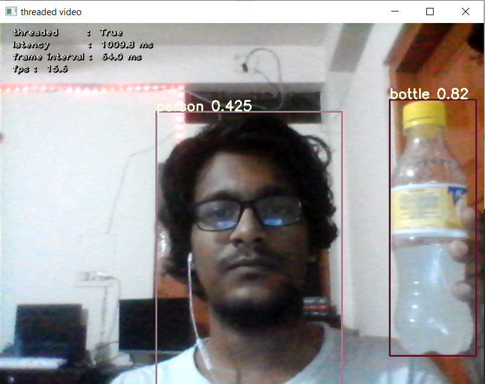

# Multi-Threaded YOLOv7 ONNX With OpenCV



## Introduction

**Multi-Threaded YOLOv7 ONNX With OpenCV** is a GitHub repository that implements the YOLOv7 object detection model using ONNX for inference and leverages OpenCV for real-time video and image processing. It's designed to provide high-performance, real-time object detection, making it suitable for various computer vision applications.

## Features

- Real-time object detection with YOLOv7 using ONNX.
- Multi-threaded inference for improved speed.
- Customizable for different YOLOv7 configurations and datasets.

## Getting Started

### Prerequisites

Before using this repository, make sure you have the following:

- Python 3.6+
- OpenCV
- NumPy
- ONNX
- ONNX Runtime (for optimized inference)
- Pre-trained YOLOv7 ONNX model weights (available from the official YOLOv7 repository)

### Installation

1. Clone the repository:

   ```
   git clone https://github.com/SihabSahariar/Multi-Threaded-YOLOv7-ONNX-With-OpenCV.git
   cd Multi-Threaded-YOLOv7-ONNX-With-OpenCV
   ```
2. Install the required Python packages:
   ```
   pip install -r requirements.txt
   ```
3. Run the app
  ```
  python app.py
  ```
### Contributing
Contributions to this project are welcome! If you find a bug or have a feature request, please open an issue. If you would like to contribute code, please fork the repository and create a pull request.
